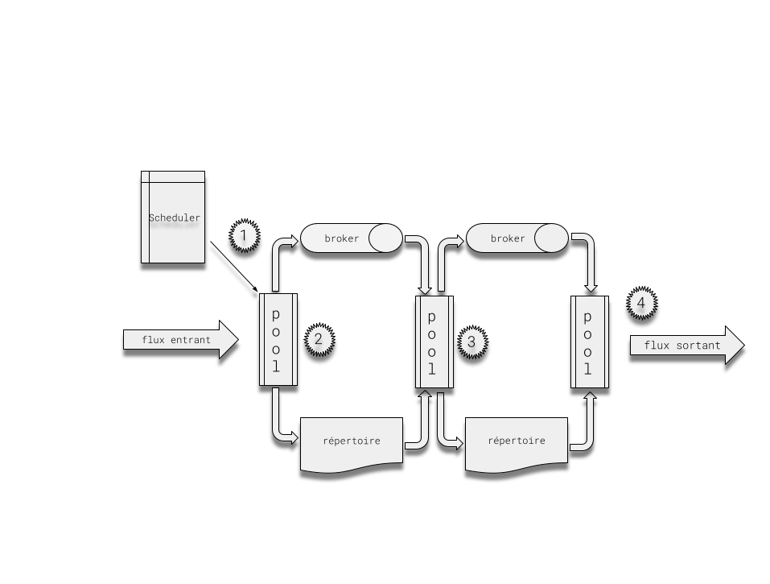

# Xelians DataHub Studio

L'ajout de nouvelles capacités (collector, transformer et sender) à la solution est possible via le module **datahub-studio**.
Pour cela il suffit d'importer le module dans un nouveau projet java et de suivre les instructions qui suivent.
Dans la mesure du possible utiliser les librairies déjà disponibles dans **le datahub-studio** pour éviter au maximum des problèmes de compatibilité.

## Fonctionnement de la solution

### Canal

Le transfert de donnée via le datahub est modelisé par un canal. Un canal possède une instance de 3 types de **workers** appelés **Collector**, **transformer** et **Sender**.
Lors du démarrage d'un canal les workers sont instanciés avec les valeurs entrées lors du paramétrage du canal via l'interface du datahub.

### Workflow



#### 1 Scheduler

Le scheduler planifie des tâches de collecte régulièrement pour tous les canaux démarrés.

#### 2 Collecte

Un pool de thread fixe est chargé d'effectuer les tâches de collecte en récupérant l'instance du **collector** correspondant et en appliquant la méthode ```collect``` expliquée plus bas.
Le ou les fichiers collectés sont écrit sur le disque dans un repertoire spécifique attribué au canal. Un broker permet de transmettre un tâche de transformation au pool suivant.

#### 3 transformation

Un pool de thread fixe est chargé d'effectuer les tâches de transformation en récupérant l'instance du **transformer** correspondant et en appliquant la méthode ```transform``` expliquée plus bas.
Le ou les fichiers sont transformés en un seul fichier écrit sur le disque dans un répertoire spécifique attribué au canal. Un broker permet de transmettre une tâche de transfert au pool suivant.

#### 4 Transfert

Un pool de thread fixe est chargé d'effectuer les tâches de transfert en récupérant l'instance du **sender** correspondant et en applicant la méthode ```send``` expliquée plus bas.
Le fichier est envoyé un détail du transfert est visible via l'interface du datahub.

## Collector

### Interface
Un collector doit nécessairement implémenter l'interface **Collector**

```java
Mono<List<String>> collect(Path toDirectory, String webhook, XDHProcessLogger logger) throws Exception;
```
La méthode **collect** prend en paramètre :
- le chemin du répertoire ou doivent être stockés les fichiers collectés.
- webhook si le canal utilise les webhooks comme notification de collecte. L'argument correspond au body de la requête webhook.
- Le loggeur à utiliser pour écrire des logs dans le fichier de log du canal

Cette méthode renvoie le nom des fichiers stockés, si une liste vide est renvoyée aucun flux n'est créé. La lecture ne doit pas être bloquée indéfiniment, elle doit stocker un nombre fini de fichier et renvoyer la liste. Les n fichiers correspondent à un flux de collecte et sont envoyés par paquet au transformer.
A chaque opération de lecture entre 1 et n (éviter de dépasser un max d'une centaine de fichiers) fichiers doivent être stockés, on peut donc avoir un collector stateful pour stocker l'état de la lecture sur le canal.
Les collectes se font de manières non concurrentes un seul thread à la fois effectuera une opération de collecte sur 1 canal particulier.

Les paramètres du collector correspondent à des variables d'instances de l'implémentation qui doivent être initialisées via le constructeur.
Pour ajouter des paramètres, il suffira donc de définir des paramètres dans le constructeur de l'implémentation.
Les types de paramètres autorisés :
- Integer / int
- Boolean / boolean
- Double /  double
- Float / float
- Long / long
- String
- Path
- List<Map>
- List<Integer | Boolean | Double | Float | Long | String>

### Gestion des erreurs

Pour afficher une erreur fonctionnelle sur l'interface et dans les logs, il suffit de lancer une ```CollectException```.
Il est possible de rajouter un code erreur :

```java
throw new CollectException("message d'erreur", "CODE_1");
```

### Configuration

Pour qu'un collector soit pris en compte il faudra définir une configuration implémentant l'interface **CollectorConfiguration**

```java
Class<? extends Collector> getCollectorClass(); // renvoi la classe de l'implémentation du collector en question
Label.Translation getName(); // le nom du collector afficher sur l'interface
Label.Translation description(); // La description du collector, par défaut vide
String id(); // id du collector
String version(); // La version du collector
WorkerForm.Form getForm(); // la définition du formulaire de paramétrage du collector
```

### temporisation

La collecte étant thread safe il est possible de temporiser la collecte en mémorisant via un attribut du collector la date de la dernière execution.
Il suffit ensuite de renvoyer une liste vide pour n'effectuer aucune collecte.

## Transformer

### Interface
Un transformer doit nécessairement implémenter l'interface **Transformer**

```java
Mono<String> transform(List<String> fileNames, Path fromDirectory, Path toDirectory, XDHProcessLogger logger) throws Exception;
```
La méthode **transform** prend en paramètre :
- La liste des noms de fichiers à transformer
- le chemin du répertoire ou sont stockés les fichiers à transformer.
- le nom du répertoire ou il faut stocker le fichier transformé.
- Le loggeur à utiliser pour écrire des logs dans le fichier de log du canal.

Cette étape correspond à la transformation de n fichiers en 1 fichier.
Cette méthode renvoie le nom du fichier transformé. La transformation est nécessairement stateless

Les paramètres du transformer correspondent à des variables d'instances de l'implémentation qui doivent être initialisées via le constructeur.
Pour ajouter des paramètres, il suffira donc de définir des paramètres dans le constructeur de l'implémentation.
Les types de paramètres autorisés :
- Integer / int
- Boolean / boolean
- Double /  double
- Float / float
- Long / long
- String
- Path
- List<Map>
- List<Integer | Boolean | Double | Float | Long | String>

### Gestion des erreurs

Pour afficher une erreur fonctionnelle sur l'interface et dans les logs, il suffit de lancer une ```TransformException```.
Il est possible de rajouter un code erreur :

```java
throw new TransformException("message d'erreur", "CODE_1");
```

### Configuration

Pour qu'un transformer soit pris en compte il faudra définir une configuration implémentant l'interface **TransformerConfiguration**

```java
Class<? extends Transformer> getTransformerClass(); // renvoi la classe de l'implémentation du transformer en question
Label.Translation getName(); // le nom du transformer afficher sur l'interface
Label.Translation description(); // La description du transformer, par défaut vide
String id(); // id du transformer
String version(); // La version du transformer
WorkerForm.Form getForm(); // la définition du formulaire de paramétrage du transformer
```


## Sender

### Interface
Un sender doit nécessairement implémenter l'interface **Sender**

```java
Mono<String> send(String fileName, Path fromDirectory, XDHProcessLogger logger) throws Exception;
```
La méthode **send** prend en paramètre :
- Le nom du fichier à envoyer
- le chemin du répertoire ou se situe le fichier
- Le loggeur à utiliser pour écrire des logs dans le fichier de log du canal.

Les paramètres du sender correspondent à des variables d'instances de l'implémentation qui doivent être initialisées via le constructeur.
Pour ajouter des paramètres, il suffira donc de définir des paramètres dans le constructeur de l'implémentation.
Les types de paramètres autorisés :
- Integer / int
- Boolean / boolean
- Double /  double
- Float / float
- Long / long
- String
- Path
- List<Map>
- List<Integer | Boolean | Double | Float | Long | String>

### Gestion des erreurs

Pour afficher une erreur fonctionnelle sur l'interface et dans les logs, il suffit de lancer une ```SendException```.
Il est possible de rajouter un code erreur :

```java
throw new SendException("message d'erreur", "CODE_1");
```

### Configuration

Pour qu'un sender soit pris en compte il faudra définir une configuration implémentant l'interface **TransformerConfiguration**

```java
Class<? extends Sender> getSenderClass(); // renvoi la classe de l'implémentation du sender en question
Label.Translation getName(); // le nom du sender afficher sur l'interface
Label.Translation description(); // La description du sender, par défaut vide
String id(); // id du sender
String version(); // La version du sender
WorkerForm.Form getForm(); // la définition du formulaire de paramétrage du sender
```

### temporisation

Il est possible de temporiser le transfert en lançant une exception de type ```DelayExecutionException```. L'utilisation d'un lock à l'interieur de la méthode ```send``` combiné au lancement d'une ```DelayExecutionException``` permet donc de sérializer et temporiser l'envoi.
il est possible de rajouter un délai en paramètre, le transfert du fichier sera retenté apres expiration du délai.

## Formulaire

Pour construire le formulaire  ```WorkerForm.Form ```  il est conseillé d'utiliser le builder ```WorkerFormBuilder ``` en utilisant la méthode ```WorkerForm.builder()```
Bien suivre les instructions de la javadoc de l'interface ```WorkerForm```. Bien veiller à respecter le nom des paramètres et le type des inputs qui doit être cohérent avec le type des paramètres, sinon le worker ne sera pas ajouté au démarrage de l'application.

## Ajout des nouveaux workers

Pour ajouter le nouveau plugin à la solution, il suffit de packager le projet en une archive de type **jar** et déposer cette archive dans un dossier "**/lib**" à créer à la racine du répertoire root de l'application.
Lors du lancement de l'application les collectors, transformers et senders implémentés correctement seront chargés dans le contexte de worker de l'application.
